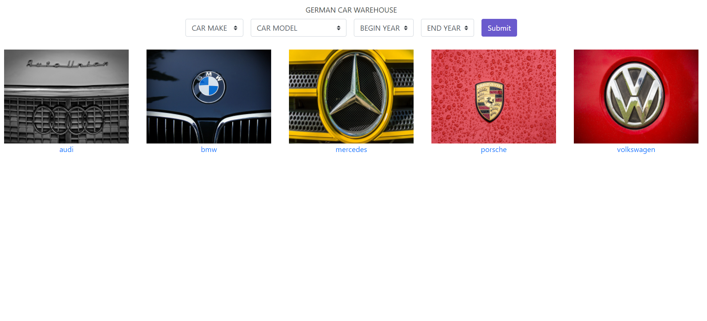
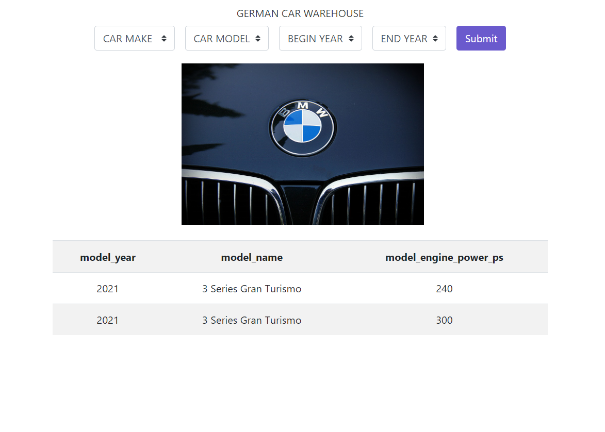

# Car-Information-Portal
This is a Django project, using JSON based API(https://www.carqueryapi.com).

Visit the hosted version of the app at https://car-information-portal-django.herokuapp.com/

# Sample image

<br>
 


Visit the hosted version of the app at 
 https://game-fan-website.herokuapp.com/

## Installation

```
git clone https://github.com/yk-jp/Car-Information-Portal.git
```

```
cd Game-Fan-Website
```

create a virtual environment   
``` 
# install virtualenv to create it
pip install virtualenv

virtualenv envname
```

activate the virtual environment you created
```
# on windows
envname\scripts\activate

# on linux
source envname/bin/activate
```

```
pip install -r requirements.txt
```

```
python3 manage.py runserver
```

Open ```http://localhost:8000``` to see the app.

# Tech Stack
 * CarQuery(https://www.carqueryapi.com)
 * HTML
 * CSS
 * Javascript
 * Jquery
 * Ajax
 * Bootstrap
 * Python
 * Django
